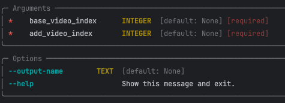

# stitchi
cli tool for video wrangling

This is currently just a proof of concept for video editing through scripts.

# 1.0 Features
A lot of these features can be expanded in the future, but the current features are below:

1. Show available videos in your directory
2. Play a video in your directory
3. Trim a video
4. Combine videos
5. Generate thumbnail sheets

# 2.0 Staring Out

## 2.0.1 Downloading FFMPEG
The following is taken from the `ffmpeg-python` docs, which explains how to install FFMPEG:
Before using ffmpeg-python, FFmpeg must be installed and accessible via the $PATH environment variable.

There are a variety of ways to install FFmpeg, such as the official download links, or using your package manager of choice (e.g. sudo apt install ffmpeg on Debian/Ubuntu, brew install ffmpeg on OS X, etc.).

Regardless of how FFmpeg is installed, you can check if your environment path is set correctly by running the ffmpeg command from the terminal, in which case the version information should appear, as in the following example (truncated for brevity):
```shell
$ ffmpeg
ffmpeg version 4.2.4-1ubuntu0.1 Copyright (c) 2000-2020 the FFmpeg developers
built with gcc 9 (Ubuntu 9.3.0-10ubuntu2)
```
Note: The actual version information displayed here may vary from one system to another; but if a message such as ffmpeg: command not found appears instead of the version information, FFmpeg is not properly installed.

   ## 2.0.2 Installing Stitchi

This is currently a CLI tool, so you will be interacting with the terminal when using this. Can be expanded into
another interface if this tool were to be further worked on.

To install the package, you can use the following:
```shell
pip install stitchi
```

## 2.1 Getting Help
Let's take a look at how to work with this application.

### 2.1.1 Available Commands

To take a look at the available menu options, type in the following:
```shell
stitchi
```
### 2.1.2 Help Option
At any time, you can take one of the commands and add the `--help` option to get more information on what the
function needs to process.

```shell
stitchi add --help
```

### 2.1.3 Example of Help Option Output
Typing the command will give you the arguments that the function needs, as well as any optional flags you 
have available.


## 3.0 Adding Two Videos

For the `add` command, you need the `base_video_index` of the main video, and the `add_video_index` of the video you
want to add to the end of the base video. Let's take a look at how to get the index of the two videos first.

### 3.1 Available Videos
Let's get the list of videos we have available by typing `show` command, to get a table of all the videos
you have available.

```shell
stitchi show
```

The output should be a table with a lot of data, including the path, the size of the file and when it was created.
The index of the file you are looking for is the very first column under `#`.

### 3.2 Run the `Add` Command
Once we have the two indexes, run the `add` command in order to clip them together.
If you include the `--output-name` flag, you can name the merged video.
When left blank, it will be given the default name.

- Remember, that the argument is currently the fullpath for the output name

```shell
stitchi add 0 1
```
- This code would merge two videos, (#0 and #1) together.
- Video #1 would get appended to the end of Video #0

# Things to Improve
1. We can decrease the latency of pulling all the files in a folder. Currently, it searches recursively and the data is pulled from different sources
2. The data could potentially be saved in a database, so we don't have to re-pull the files inside a folder every time
3. Add different types of transitions. If we focus on improving the `add` function, it can be made to look professional
   1. https://trac.ffmpeg.org/wiki/Xfade have some fade types available depending on how we want to transition clips
   2. There's also options with overlays, so we can get really creative
4. Thumbnail sheet generation can be improved by adding data on the resolution and duration
5. Can automate the entire video editing process (will need to be able to run independent of the CLI)
6. Adding multiple videos together at once
7. The optional path for add could be cleaned up to be able to handle whitespace
8. Easy video transfers (make it easier to save down videos you want to edit)
